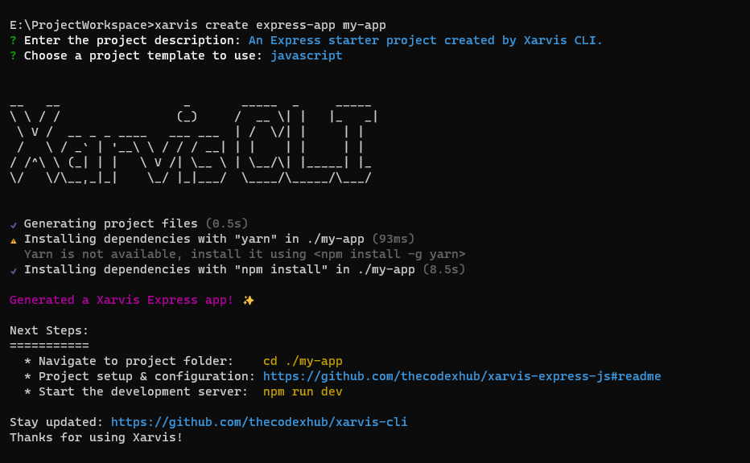

# Xarvis CLI


[](https://opensource.org/licenses/MIT)
[](https://www.npmjs.com/package/xarvis-cli)

A Command-Line Interface for generating a production-ready starter template.

Developed with 💜 by [thecodexhub](https://github.com/thecodexhub)



## Supported Templates

- [xarvis-express-js](https://github.com/thecodexhub/xarvis-express-js) - A Xarvis Express app with JavaScript: (See [features](https://github.com/thecodexhub/xarvis-express-js#features) list)
- [xarvis-express-ts](https://github.com/thecodexhub/xarvis-express-ts) - A Xarvis Express app with TypeScript: (See [features](https://github.com/thecodexhub/xarvis-express-ts#features) list)

## Installation

The below command will make the xarvis command available globally, allowing you to use it from anywhere in your terminal.

```
$ npm install -g xarvis-cli
```

## Commands

### `xarvis -h` or `xarvis --help`

**Display the usage information.**

```shell
Usage: xarvis <command> [arguments]

🚀 A Command-Line Interface for generating production ready starter template.

Options:
  -v, --version   Display the current version.
  -h, --help      Display the usage information.

Commands:
  create          Creates a new xarvis project in the specified directory.
  help [command]  Display the usage information.
```

### `xarvis create express-app`

**Creates a new Xarvis Express project in the specified directory.**

```shell
Usage: xarvis create express-app <project-name> [arguments]

Creates a new Xarvis Express project in the specified directory.

Options:
  -o, --output-directory  The optional desired output directory when creating a new project.
  -t, --template          The template for this project. (choices: "javascript", "typescript")
      --description       The description for this new project. (default: "An Express starter project
                          created by Xarvis CLI.")
      --skip-git          Whether or not to skip initializing git (default: false)
  -h, --help              Display the usage information.
```

_Note: The `--template` and `--description` are required. If not provided by the CLI options, questions will be prompted, as shown in the below example._

```shell
$ xarvis create express-app my-app
? Enter the project description: An Express starter project created by Xarvis CLI.
? Choose a project template to use: (Use arrow keys)
> javascript
  typescript
```

### Use `-h` or `--help` for any usage information

```shell
# Displays usage information for Xarvis CLI
$ xarvis -h

# Displays usage information for `xarvis create` command
$ xarvis create -h

# Displays usage information for `xarvis create express-app` command
$ xarvis create express-app -h
```

## License

The project is released under the [MIT License](LICENSE). Learn more about it, [here](https://opensource.org/license/mit/).

## Xarvis Feature Request

We welcome any ideas or recommendations about how to make the tool better. Unless there is an overwhelming demand for a feature, it might not get implemented.

Before posting, be kind to your surroundings and the authors who take joy in developing new features and writing documentation to help you.

### Create a Feature Request (Issue)

Create an issue including as much information as possible to your proposal. To create an issue -

- Go to the [issues](https://github.com/thecodexhub/xarvis-cli/issues) tab from the project repository.
- Then click on [new issue](https://github.com/thecodexhub/xarvis-cli/issues/new/choose).
- You'll have to choose type of the issue. In this case, click on **Get Started** button for the Feature Request type.
- Fill up the details and **Submit new issue**.

<br/><hr /><br/>

<center>
💜 Love using Xarvis? Give this repository a star! ⭐
</center>
